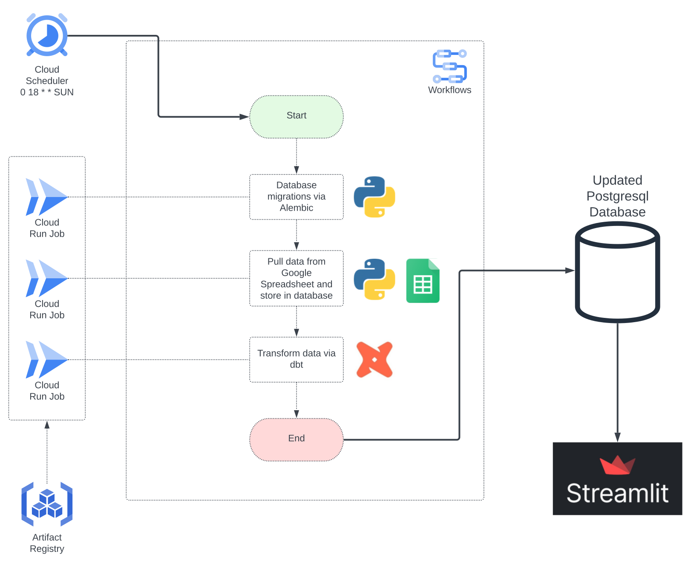

# my-bjj-journey

A personal project that extracts, stores, and displays data related to
my Brazilian jiu-jitsu journey.

**Dashboard app:** https://bjj-journey.streamlit.app/

Repository contains:

- Pipeline for extracting and transforming data from a Google spreadsheet.
- Code for creating the Streamlit app that displays data.

## Architecture

### Data Pipeline

1. Cloud Scheduler triggers a Workflow every Sunday at 6pm ET.
2. The Workflow runs three Cloud Run jobs in the below order. Each of these jobs are
run using an image stored in Artifact Registry.
    1. Database migrations are run to make sure schemas in the database are
    up-to-date.
    2. Data is pulled from a Google Spreadsheet and stored in the database.
    3. Additional data transformations are applied via dbt.
3. When the Streamlit app loads, it queries the database to retrieve the data that
feed into the metrics and visualizations.

Google Cloud infrastructure is provisioned via Terraform, and containerization is
handled via Docker.

## Future Updates

- Creation of a CI/CD process.

## Tools Used

- **Containerization**: [Docker](https://www.docker.com/)
- **Database**: PostgreSQL 15 via [Neon](https://neon.tech/)
- **Database Migrations**: [Alembic](https://alembic.sqlalchemy.org/en/latest/)
- **Data Transformation**: [dbt](https://www.getdbt.com/)
- **Data Visualization**: [Streamlit](https://streamlit.io/)
- **Google Cloud Services**:
    - **Scheduler**: [Cloud Scheduler](https://cloud.google.com/scheduler)
    - **Orchestration**: [Workflows](https://cloud.google.com/workflows)
    - **Serverless Computing**: [Cloud Run](https://cloud.google.com/run)
    - **Docker Repository**: [Artifact Registry](https://cloud.google.com/artifact-registry)
    - **Secrets Manager**: [Secret Manager](https://cloud.google.com/secret-manager)
- **Infrastructure**: [Terraform](https://www.terraform.io/)
